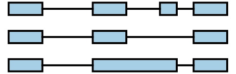
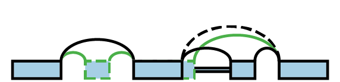
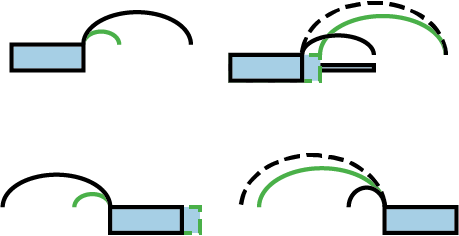

# MAJIQ and VOILA

MAJIQ uses the results of RNA-seq experiments to analyze alternative splicing.
In order to facilitate such analysis, MAJIQ is divided into three modules:

1. **MAJIQ Builder** define splicegraph per gene and coverage over local
   splicing variations (LSVs) per experiment.
2. **MAJIQ Quantifiers** quantify inclusion or differences between individual
   or groups of input experiments.
3. **VOILA**: visualize/summarize splicing quantifications.


Table of contents:

[TOC]


# Installation

## Requirements

MAJIQ requires:

+ [HTSLib][htslib-src] (1.10 or later).
+ C++ compiler with OpenMP, C++11
  (e.g. GNU gcc >= 7.2, RedHat gcc >= 4.7.2, etc.).
+ Python (3.8 or later).
+ setuptools (45 or later).


## HTSLib installation

MAJIQ requires [HTSLib][htslib-src] (>= 1.10) to be installed.
This may already available in a shared directory of your environment,
otherwise, you can install HTSLib from source.
For example, to install htslib-1.13 to `~/install/htslib-1.13`, you could run:

```bash
# download htslib 1.13 archive to current directory
curl -OL https://github.com/samtools/htslib/releases/download/1.13/htslib-1.13.tar.bz2
tar -xf htslib-1.13.tar.bz2  # extract archive
cd htslib-1.13  # change into htslib source directory
# configure, make, and install htslib to ~/install/htslib-1.13
./configure --prefix=$HOME/install/htslib-1.13
make
make install
```

See [`INSTALL` from HTSLib source][htslib-install] for detailed installation
instructions for HTSLib.

   [htslib-src]: https://github.com/samtools/htslib/releases
   [htslib-install]: https://raw.githubusercontent.com/samtools/htslib/1.13/INSTALL


## MAJIQ installation

Install MAJIQ using pip.
MAJIQ setup needs to know where HTSLib is installed.
By default, it assumes that the library and include directories are in the Unix
default locations: `/usr/local/lib`, `/usr/local/include`.
If this is not the case, please set the environment variables
`HTSLIB_LIBRARY_DIR` and `HTSLIB_INCLUDE_DIR` to the actual locations.
For example, with previous instructions, from the same directory as this README:

```bash
# change to where library/include directories are installed
export HTSLIB_LIBRARY_DIR=$HOME/install/htslib-1.13/lib
export HTSLIB_INCLUDE_DIR=$HOME/install/htslib-1.13/include
# NOTE: from same directory as this README
pip install .  # install both majiq and voila
```


## VOILA-only installation

It is possible to install only VOILA.
This can be useful if you want to visualize outputs produced on a different
computer.
VOILA does not require HTSLib or a C++ compiler.
Installation is done with pip:

```bash
pip install ./voila
```


# Usage


## MAJIQ Builder

The MAJIQ Builder defines a splicegraph and coverage over local splicing
variations per input experiment and is run using the command `majiq build`.

From the perspective of input and output files, the MAJIQ builder takes as
input and produces as output the following:

Input files:

+ GFF3 format annotation database defining annotated transcripts.
  This defines the annotated exons, junctions, and retained introns which
  initialize the output splicegraph.
+ Input RNA-seq experiments to obtain coverage over LSVs for.
  This can either be in the form of BAM files (with contigs matching the GFF3
  file) or "SJ" files produced by previous runs of the MAJIQ builder using the
  same GFF3.


Output files:

+ Splicegraph database (`splicegraph.sql`) defining annotated and _de novo_
  exons, junctions, and retained introns on which LSVs are defined. Used by
  VOILA.
+ SJ files (`{experiment}.sj`) reusable intermediate files with coverage
  information per experiment provided in BAM format.
  Used as input by subsequent runs of the MAJIQ builder (used to speed up
  execution of future builds with the same experiment and GFF3 by parsing input
  BAM file only once).
+ MAJIQ files (`{experiment}.majiq`): output files per experiment with raw and
  bootstrapped coverage per LSV.
  Used as input by MAJIQ Quantifiers.


From the perspective of the command-line, MAJIQ specifies the locations of
these inputs and outputs using the required arguments:

+ `transcripts` (positional argument): path to input GFF3 file.
+ `-o OUTDIR`: path for output directory to save splicegraph, SJ, MAJIQ files
  to.
+ `-c CONF`: input configuration file defining where to find input experiments
  and how they will be grouped together for building the splicegraph (see below
  for details).


The MAJIQ builder expects an input configuration file based on
[the Windows INI/configparser format][configparser].
The configuration file has sections:

+ `[info]` (required)
    + `sjdirs` and `bamdirs`: comma separated list of paths to search for SJ
      files and bam files in.
    + `genome`:  name of species/reference used by VOILA for genome browser
      links.
    + `strandness=[forward|reverse|none]`: set strandness used by default for
      all experiments (can override with `[opts]` section).
+ `[experiments]` (required)
    + Specify independent "build groups" that MAJIQ processes together.
    + Specify build group with format
      `{build_group_name}=experiment_prefix[,experiment_prefix[,[...]]`:
      group name, equals, comma-separated list of prefixes to `bam` or `sj`
      (looks for SJ files first, then BAMs).
+ `[opts]` (optional)
    + override strandness from `[info]` by specifying
      `{experiment_prefix}=strandness:[forward,reverse,none]`
      for experiments that need a different strandness.

   [configparser]: https://docs.python.org/3/library/configparser.html


So an example could look like:

```toml
[info]
genome=my_species_reference_name
# paths for experiment directories
bamdirs=relative_paths_work/bams,/data/absolute_paths_too/bams
sjdirs=previous_build,/data/another_previous_build/
# default strandness for experiments
strandness=none

[experiments]
k562_replicates=k562.rep001,k562.rep002,k562.rep003
sample_ABC=sample_ABC
sample_DEF=sample_DEF

[opts]
# these experiments need a different strandness specified
k562.rep003=strandness:reverse
sample_ABC=strandness:forward
```

Build groups are used when multiple experiments with evidence for a junction or
retained intron should be required before they are considered reliable (whether
annotated or _de novo_).
The set of reliable junctions and retained introns determines the splicegraph
and which LSVs are saved to output majiq files for quantification.
When analyzing patterns summarizing groups of experiments (replicates of a cell
line/condition or samples from the same tissue type), grouping them together is
often appropriate.
This allows focus on evidence found in multiple experiments.
However, when analyzing variation between individual samples (no replicates,
differences between samples from the same tissue type), grouping samples
independently may be more appropriate.
This allows analysis of changes found in single experiments.
The most important optional parameter governing analysis of these build groups
is `--min-experiments`, which specifies how many (or what proportion) of
experiments in a build group are required to provide evidence for a reliable
intron or junction.
Note when `--min-experiments=1` that there is no difference between grouping
experiments together vs independently, as a single experiment from any build
group will then provide sufficient evidence.

Explanations of the other optional parameters can be found by running
`majiq --help`.


## MAJIQ Quantifiers

The MAJIQ quantifiers process coverage from majiq files produced by the builder
and produces "voila" files which are used by VOILA for interactive
visualization or TSV output.
They identify which LSVs meet criteria for "quantifiability" by considering
thresholds on the minimum number of total reads and nonzero read positions.
Then, for quantifiable LSVs, MAJIQ infers posterior distributions of the
**P**ercent **S**pliced **I**n (PSI) on bootstrap replicates of LSV
coverage as described in [Vaquero-Garcia et al. 2016][majiq-v1].

   [majiq-v1]: https://doi.org/10.7554/eLife.11752

MAJIQ provides three different quantification modes:

+ `majiq psi`: summarize inclusion from a single group of experiments as a
  posterior distribution over PSI.
  Input experiments are considered as replicates (single distribution on PSI
  summarizing the group).
  First described in [Vaquero-Garcia et al. 2016][majiq-v1].
+ `majiq deltapsi`: summarize differences in inclusion between two groups as a
  posterior distribution over a difference in PSI (dPSI).
  Input experiments are considered as replicates (one distribution on PSI per
  group, combined for one distribution on dPSI between groups).
  First described in [Vaquero-Garcia et al. 2016][majiq-v1].
+ `majiq heterogen`: test differences in PSI between samples from groups.
  Input experiments are considered independent samples (one distribution on PSI
  _per sample_).
  Test for differences between groups using 2-sample statistical tests on
  posterior means and samples generated from posterior distributions.
  First described in [Majiq v2 paper (in preparation)][majiq-v2].

   [majiq-v2]: about:blank


These quantifiers generally have two sets of required arguments:

+ Output directory `-o OUTDIR` for output files.
+ Input MAJIQ files with LSV coverage information
    + `majiq psi`: Specify group name with `-n NAME`, input MAJIQ files using
      `files [files ...]` positional arguments.
    + `majiq {deltapsi,heterogen}`: Specify group names with
      `-n NAME_GRP1 NAME_GRP2`, input MAJIQ files using
      `-grp1 FILES1 [FILES1 ...]` and `-grp2 FILES2 [FILES2 ...]`.


Group names are restricted to alphanumeric and underscore characters.
LSV quantifiability thresholds determined by optional arguments
`--min-experiments`, `--minreads`, and `--minpos`.
For deltapsi and heterogen quantifiers, LSVs must pass thresholds in both
quantification groups independently.
Additional details on optional parameters can be found by adding `--help` to
the subcommand of interest (e.g. `majiq deltapsi --help`).


## VOILA

VOILA takes a splicegraph database (`splicegraph.sql` from MAJIQ builder) and
voila files (from MAJIQ quantifiers) to produce human-readable summaries,
either as:

+ `voila tsv`: produce tab-separated values (tsv) file describing
  quantifications and splicegraph information per LSV.
+ `voila modulize`: group LSVs into non-overlapping splicing modules,
  categorize the events seen in each module, and produce tab-separated values
  (tsv) files with quantifications for each module and event type.
+ `voila view`: start web service for interactive visualization of splicegraph
  and quantifications in the web browser.


These commands take input splicegraph and voila files in arbitrary order as
positional arguments.

For `voila tsv`:

+ The output TSV file from `voila tsv` has path specified by required argument
  `-f FILE_NAME`.
+ You usually want to specify the optional argument `--show-all` with
  `voila tsv` in order to show all quantified LSVs, not just those identified as
  changing (details on thresholds available by running `voila tsv --help`).


For `voila modulize`:

+ Specify the output directory for output TSV files with required argument
  `-d OUTPUT_DIRECTORY`
+ Like `voila tsv`, `voila modulize` only outputs splicing modules that are
  identified as changing between quantified groups.
  Add the optional argument `--show-all` to output all modules.
+ See `voila modulize --help` for more options over what is output.


For `voila view`:

+ by default, voila view serves to `localhost` on a random port.
  These parameters can be changed using `--host HOST` and `-p PORT`.
  This can be used to serve VOILA from a remote server to a local machine,
  especially with the help of ssh tunneling/port forwarding.


Additional details on usage can be found by adding `--help` to the subcommand
of interest (e.g. `voila view --help`)


# MAJIQ definitions


## What is a splicegraph?

Genes are frequently modeled as a collection of transcripts.
These transcripts are modeled as exons connected by junctions between adjacent
exons.
For example, a gene with 4 transcripts could be represented on the genome
browser like:



A splicegraph is an alternative model, where there is a single set of exons
connected by junctions and retained introns.
These junctions and retained introns are connections represent how exons
can be spliced together.
For example, the 4 transcripts above can be represented instead by the
splicegraph:


## What is an LSV?

LSV stands for **l**ocal **s**plicing **v**ariation.
LSVs model splicing decisions that start or end at the same exon.
A single-source LSV is an exon and all connections that originate from that exon.
A single-target LSV is an exon and all connections that end at that exon.
For a more formal definition, please see [Vaquero-Garcia et al. 2016][majiq-v1].

An example splicegraph and associated LSVs:





## How are LSVs quantified?

LSVs are quantified in terms of **p**ercent **s**pliced **i**n (PSI).
PSI is the relative inclusion level of each connection in the LSV.
In general, PSI takes values between 0 and 1, and the sum of PSI over the
connections of a single LSV will add up to 1.

Differences in quantifications between (groups of) experiments are modeled
as differences in PSI (dPSI).
dPSI takes values between -1 and 1, and the sum of dPSI for the connections
of a single LSV will add up to 0.
