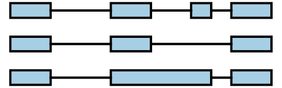
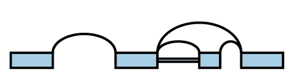
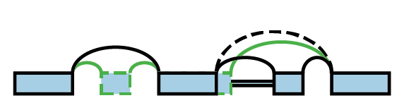
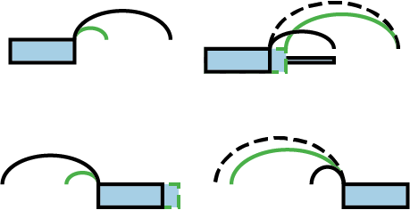

##############
Quick overview
##############

.. role:: bash(code)
   :language: bash

MAJIQ is a software package for defining and quantifying local splicing
variations (LSVs) from RNA-seq.
:ref:`Install MAJIQ <installing>` using the source code and pip.
Access the main user-facing pipelines using the command :bash:`majiq`:

.. command-output:: majiq
   :returncode: 1

MAJIQ expects GFF3_ files and `SAM/BAM`_ files as input.
The GFF3_ file is used to build an initial model of all annotated splicing
changes in each gene.
The `SAM/BAM`_ files are used to extract coverage over spliced junctions and
retained introns in different RNA-seq experiments.
MAJIQ uses this coverage to identify novel/unannotated junctions and retained
introns, updating the model of all splicing changes.
MAJIQ uses the updated model and per-experiment coverage to quantify splicing.

MAJIQ models splicing changes in each gene in terms of a
:ref:`splicegraph <what-is-splicegraph>`.
MAJIQ quantifies splicing in terms of :ref:`PSI <how-lsvs-quantified>` on
subsets of splicegraphs called :ref:`LSVs <what-is-lsv>`.

So:

- :ref:`MAJIQ Builder <majiq-build>` creates a
  :py:class:`~new_majiq.SpliceGraph` file with the model of all genes and
  :py:class:`~new_majiq.SJExperiment` files with coverage for each experiment
  (:bash:`majiq build`).
- Then, the :ref:`MAJIQ PsiCoverage command <majiq-psi-coverage>` uses these
  two to create :py:class:`~new_majiq.PsiCoverage` files with summarized raw
  and bootstrap coverage over LSVs (:bash:`majiq psi-coverage`).
- If used, :ref:`MOCCASIN <moccasin>` creates batch-corrected versions of these
  files (:bash:`majiq moccasin`).
- Finally, MAJIQ subsequently uses these files for downstream quantification
  and analysis
  (:ref:`MAJIQ quantifiers <quantifiers>`, MAJIQ Mendelian [working name]).

.. _GFF3: https://m.ensembl.org/info/website/upload/gff3.html
.. _SAM/BAM: https://samtools.github.io/hts-specs/SAMv1.pdf

.. _what-is-splicegraph:

What is a splicegraph?
======================

Genes are frequently modeled as a collection of transcripts.
These transcripts are modeled as exons connected by junctions between adjacent
exons.
For example, a gene with 4 transcripts could be represented on the genome
browser like:

A splicegraph is an alternative model, where there is a single set of exons
connected by junctions and retained introns.
These junctions and retained introns are connections represent how exons
can be spliced together.
For example, the 4 transcripts above can be represented instead by the
splicegraph:

.. _what-is-lsv:

What is an LSV?
===============

LSV stands for **l**\ ocal **s**\ plicing **v**\ ariation.
LSVs model splicing decisions that start or end at the same exon.
A single-source LSV is an exon and all connections that originate from that exon.
A single-target LSV is an exon and all connections that end at that exon.
For a more formal definition, please see [Vaquero2016]_.

An example splicegraph and associated LSVs:

.. _how-lsvs-quantified:

How are LSVs quantified?
========================

LSVs are quantified in terms of **p**\ ercent **s**\ pliced **i**\ n (PSI).
PSI is the relative inclusion level of each connection in the LSV.
In general, PSI takes values between 0 and 1, and the sum of PSI over the
connections of a single LSV will add up to 1.

Differences in quantifications between (groups of) experiments are modeled
as differences in PSI (dPSI).
dPSI takes values between -1 and 1, and the sum of dPSI for the connections
of a single LSV will add up to 0.

PSI and dPSI are not directly observed, so MAJIQ uses different statistical
models to infer their values under different assumptions
([Vaquero2016]_, [VaqueroAicherJewellGazzara2021]_).

What about VOILA?
=================

VOILA is a companion software package for visualization of MAJIQ splicing
analyses.
It currently only supports MAJIQ v2, the previous version.
This page will be updated once we are finished updating it for the new version.
