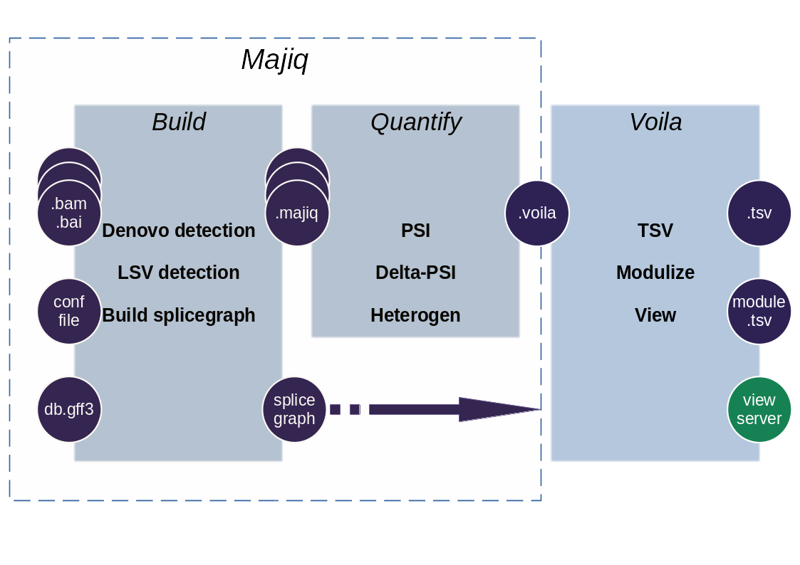

##############
Quick overview
##############

MAJIQ and Voila are two software packages that together define, quantify, and visualize local splicing variations (LSV) from RNA-Seq data. Conceptually, MAJIQ/Voila can be divided into three modules:

- MAJIQ Builder: Uses RNA-Seq (BAM files) and a transcriptome annotation file (GFF/GTF) to define splice graphs and known/novel Local Splice Variations (LSV).
- MAJIQ Quantifier: Quantifies relative abundance (PSI) of LSVs and changes in relative LSV abundance (delta PSI) between conditions with or without replicates. Used with one or more of the outputs from the builder.
- Voila: Different modes for converting the quantified results into human usable output. Can make TSV, Modulized, or Visual interactive output.

Prior to MAJIQ
--------------

You will need to process your sequences / trim / quality check / etc to create BAM files
along with their indexes (.bam.bai). There are a few possible options for this step. Options
we have found to work well include STAR_ and bbduk_.

In addition, you will need a gene annotation database in GFF3 format, for example, Ensembl_.

*Please make sure that the gene names from your annotation exactly match the gene names from your bamfiles.*

.. _MAJIQ Builder quick:

MAJIQ Builder
~~~~~~~~~~~~~

First, you will need to prepare the config file for your specific aligned experiments, you can find a sample config
template and more in depth instructions in :ref:`MAJIQ Builder full`

MAJIQ Quantifiers
-----------------

You may need to run quantifier once or more times depending on the number of comparisons you'd like to process.
Available modes are listed below.

Psi Quantifier
~~~~~~~~~~~~~~

<Paul to add example from workshop>

Deltapsi Quantifier (replicate experiments)
~~~~~~~~~~~~~~~~~~~~~~~~~~~~~~~~~~~~~~~~~~~

<Good quick use case for dpsi? (can also be workshop theoretically)>

Heterogen Quantifier (independent experiments)
~~~~~~~~~~~~~~~~~~~~~~~~~~~~~~~~~~~~~~~~~~~~~~

<Good quick use case for het? (can also be workshop theoretically)>

Analysis with VOILA
-------------------

<paul to add commands for voila tsv, modulize, and view>

.. _STAR: https://github.com/alexdobin/STAR
.. _bbduk: https://jgi.doe.gov/data-and-tools/bbtools/bb-tools-user-guide/bbduk-guide/
.. _Ensembl: https://useast.ensembl.org/info/data/ftp/index.html