Event Types Identified
======================

Modules are comprised of 1 or more Events, of which the following are
currently identified:

-  `Cassette Exons <#cassette>`__

-  `Tandem Cassette <#tandem>`__

-  `Alternative Splice Sites - 5’, 3’, or both - (Alt 5/3) <#altsplice>`__

-  `Putative Alternative Splice Sites (P_Alt) <#paltsplice>`__

-  `Mutually Exclusive Exons (MXE) <#mxe>`__

-  `Alternative First/Last Exons (AFE/ALE) <#afeale>`__

-  `Putative Alternative First/Last Exons (P_AFE/ALE) <#pafeale>`__

-  `Alternative Intron <#intron>`__

-  `Orphan Junction <#orphan>`__

-  `Exitron <#exitron>`__

-  `Constitutive Junction or Persistent Intron <#constitutive>`__

-  `Multi Exon Spanning <#mes>`__

Notes

-  If no events are identified in a module, the module is discarded. We
      have tested the voila Categorizer on highly complex human samples,
      and so far, we are able to identify events for all modules. So, we
      \*think\* we’re capturing all possible events a module could have.
      However, if you think you find a case where a module was
      discarded, but it shouldn’t have been. Please let us know! There
      is always a bigger fish, and there are always exceptions in
      Biology :)

-  Another reason modules are discarded is if you don’t turn on
      `--show-all-modules <#wtx5lt9wegzj>`__.

-  Constitutive Junctions are not reported by default, you must turn on
      `--keep-constitutive <#bieyaxqd0clv>`__ (and we will automatically
      also turn on `--show-all-modules <#wtx5lt9wegzj>`__).

.. _cassette:

Cassette Exons
--------------

|image5|

*Note: C1_C2 and C2_C1 refer to the same junction, but the
quantifications reported in the output file are from two different LSVs'
points of view (Reference Exon 4 (C1) or 6 (C2), respectively).
Normally, these quantifications are identical, but read coverage for
C1_A or C2_A may differ, and different read coverages alter the
beta-posterior used for quantifications.*

The “cassette.tsv” output file contains information about each cassette
splicing event. This information includes coordinates for the exons and
junctions as well as quantifications for each junction, from the point
of view of usually two LSVs (sometimes there is not enough read coverage
in one of the LSVs). Each cassette is represented by four rows. Each of
the four rows in the file corresponds to a single junction
quantification from the point of an LSV (or from the point of view of
the reference exon of where there could have been an LSV, but MAJIQ
didn't see enough coverage for the LSV to be quantifiable). So, the
skipping junction is represented by two rows: one row from the point of
view of C1 (C1_C2) and the second row from the point of view of C2
(C2_C1). Here are the column names in the file:

-  Exon Spliced With: <C1, A, or C2>

-  Exon Spliced With Coordinate: <coordinate range>

-  Junction Name: <C1_A, C1_C2, C2_A, or C2_C1>

-  Junction Coordinate: <coordinate range>

.. _tandem:

Tandem Cassette
---------------

|image6|

-  Same definition as a cassette exon, but there are 2+ alternative
      exons joined by junctions in the middle

-  The output file is the same as for cassette exon, but also includes a
      column specifying how many middle exons are in the tandem cassette

.. _altsplice:

Alternative Splice Sites - 5’, 3’, or both - (Alt 5/3)
------------------------------------------------------

|image7|

.. _paltsplice:

Putative Alternative Splice Sites (P_Alt 5/3)
---------------------------------------------

|image8|

**TODO: compare to actual A3/A5 and decide if this should be renamed**

.. _mxe:

Mutually Exclusive Exons (MXE)
------------------------------

|image9|

.. _afeale:

Alternative First/Last Exons (AFE/ALE)
--------------------------------------

|image10|

.. _pafeale:

Putative Alternative First/Last Exons (P_AFE/ALE)
-------------------------------------------------

|image11|

.. _intron:

Alternative Intron
------------------

|image12|

.. _orphan:

Orphan Junction
---------------

|image13|

Orphan junctions are where splice junction reads are observed between
two loci, but there is no evidence of complete exons. This is due to a
lack of corresponding splice junction reads supporting a 3’ splice site
upstream of the 5’ side of the orphan junction, and a lack of splice
junction reads supporting a 5’ splice site downstream of the 3’ side of
the orphan junction.

Exitron
-------

|image14|

.. _constitutive:

Constitutive Junction or Persistent Intron
------------------------------------------

|image15|

Persistent introns are an artefact from annotations not supported by
your data; persistent introns occur when an input GFF defines a junction
between two distinct exons, but these splice sites have zero read
evidence in your data. Thus, the “intron” persists … (the name comes
from a wonderfully contentious in-lab debate and vote).

Constitutive Junctions and Persistent Introns are defined as follows:

-  Two exons connected by 1 junction/intron

-  From the upstream exon, only 1 junction/intron splices out

-  From the downstream exon, only 1 junction/intron splices in

-  If the 1 junction/intron has fewer than a threshold number of reads,
      then it is not "constitutive/persistent"

   -  See: `--keep-constitutive <#bieyaxqd0clv>`__

.. _mes:

Multi Exon Spanning
-------------------

|image16|

Other
-----

LSVs that are identified and quantified by MAJIQ sometimes do not make
it into the event tsvs. Usually, this is due to a transcript annotation
that is inconsistent with your data. For example, in the following
cassette exon, the alternative exon is a target LSV because of an
annotated splice junction that is never used in your data:

|image17|

The other.tsv file contains a list of LSVs that are not captured by the
standard event tsvs.

Although unlikely, sometimes junction(s) within a Module do not fit
\*any\* of our event definitions. These junctions (and their associated
exons) will be listed in two columns in other.tsv, “other_junctions” and
“other_exons.” In the above example, these two columns would be empty
since dotted junction is decomplexified

.. _pmgr:

Putative Multi-Gene Regions
---------------------------

|image18|

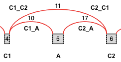
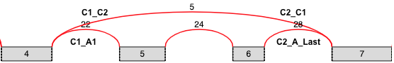
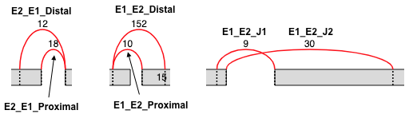
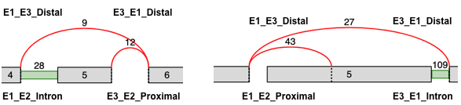
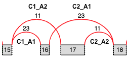
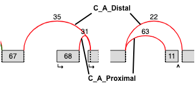
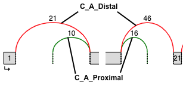
.. |image12| image:: modulizer_media/image1.png
   :width: 1.17708in
   :height: 1.14583in
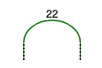
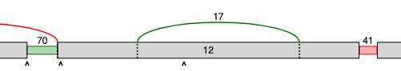
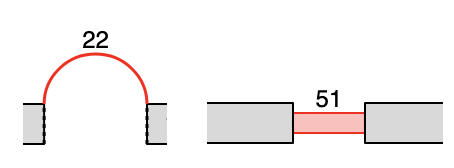
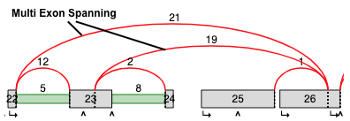
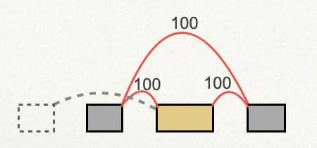
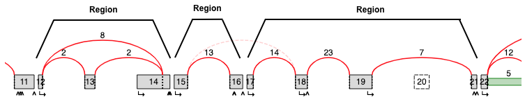