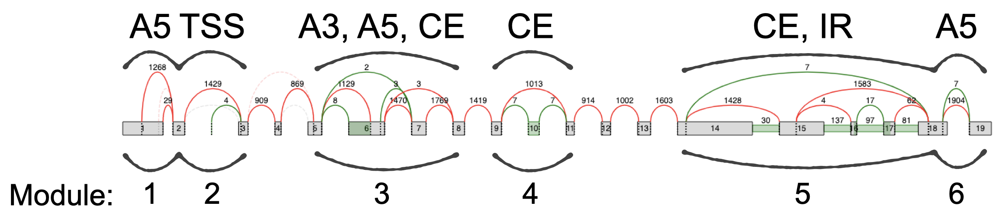

Examples
========

Six module example
~~~~~~~~~~~~~~~~~~

|image19|\ The TSS is its own module since it doesn’t overlap with other
modules. A5, alternative 5’ splice site; A3, alternative 3’ splice site;
CE, cassette exon; IR, intron retention; TSS, transcript start site.

Output Files
============

*All output files (including summary.tsv) have the following columns:*

-  Module ID

   -  Unique identifier for the module, where <N> is the nth module
         found along the gene, scanning from 5’ to 3’.

-  LSV ID(s): One or two LSV ID(s) separated by semi-colon

-  Gene Name

-  Gene ID

-  Chr

-  Strand

*Each event file also has exon and junction name and coordinate
columns:*

-  Reference Exon Coordinate (if LSVs may be associated with the event)

-  Exon or Junction Name

-  Exon or Junction Coordinate

*Plus the following columns if E(PSI) voila files provided:*

-  <VoilaFileName>_E(PSI)

   -  Expected value of the PSI distribution for each junction

-  <VoilaFileName>_Var(E(PSI))

   -  Variance of the PSI distribution for each junction

   -  Note: take the square root to obtain the standard deviation of the
         PSI distribution

-  <+Two more columns for each input Voila PSI file>

*Or, the following if E(dPSI) voila files provided:*

-  <VoilaFileName>_E(dPSI)

   -  Expected value of the dPSI distribution for each junction

-  <VoilaFileName>_P(\|dPSI|>=0.20)

   -  Probability \|dPSI|>=0.2 for each junction

   -  Note, ‘0.20’ is the default, but this threshold is specified by
         `--threshold <#6vjoi6vfq3rx>`__

-  <VoilaFileName>_P(\|dPSI|<=0.05)

   -  Probability \|dPSI|<=0.05 for each junction

   -  Note, ‘0.05’ is the default, but this threshold is specified by
         `--non-changing-threshold <#6oe52jro363h>`__

-  <VoilaFileName>_<Group1>_E(PSI)

   -  Expected value of the PSI distribution for each junction

   -  Note: if one of the input files is <Group1>.voila.psi, the
         quantifications from the voila.psi file will be displayed, but
         \*not\* the quantification from the voila.deltapsi file. This
         is done to avoid having duplicate columns.

-  <VoilaFileName>_<Group2>_E(PSI)

   -  Expected value of the PSI distribution for each junction

   -  Note: if one of the input files is <Group1>.voila.psi, the
         quantifications from the voila.psi file will be displayed, but
         \*not\* the quantification from the voila.deltapsi file. This
         is done to avoid having duplicate columns.

-  <+Five more columns for each input Voila dPSI file>

