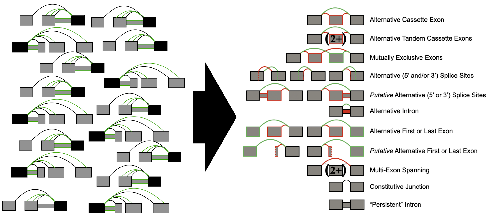
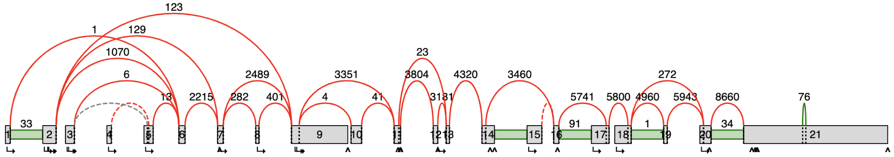
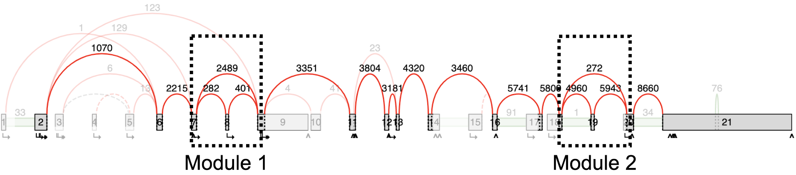
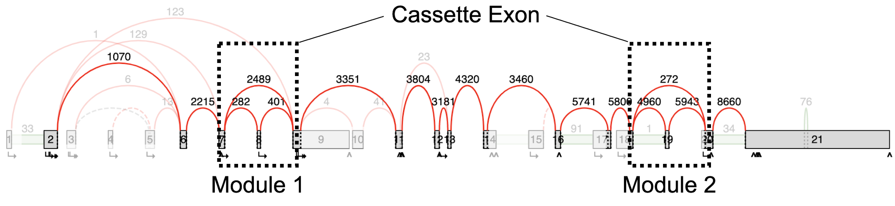

How VOILA categorizer works
===========================

Decomplexify
~~~~~~~~~~~~

Purpose: focus on just the biologically relevant junctions and exons in
the splicegraph.

   Before decomplexifying:

|image1|

   After decomplexifying *(e.g. here, using*\ `decomplexify reads
   threshold <#e2k4fslxz7qh>`__\ *of 200)*:

|image2|

This should look familiar (see: `MAJIQ Build
simplifier <https://biociphers.wordpress.com/2019/05/13/time-to-kis-as-keep-it-simple-for-alternative-splicing/>`__).
A critical difference, however, is that the MAJIQ Build simplifier
removes junctions from the splicegraph *before* the MAJIQ Quantifier.
Thus, the MAJIQ Build simplifier affects estimates of PSI. The VOILA
categorizer, however, operates downstream and independently of the MAJIQ
Build, so since this decomplexifier stage simply ignores irrelevant
junctions; junction PSI estimates from the input VOILA files are not
altered.

Note: by default, junctions that are retained have PSI>=0.05 in any one
of the input voila files. Decomplexify by default also removes junctions
with 0 reads. See `decomplexify stage
arguments <#decomplexify-stage-arguments>`__ for more options and
details.

Identify `Modules <#splicegraph-modules>`__
~~~~~~~~~~~~~~~~~~~~~~~~~~~~~~~~~~~~~~~~~~~

|image3|\ Modules in general have a single entry where there is a split
splicing decision, and a single exit. However, alternate starts and ends
of transcripts may also be modules (see
`example <#six-module-example>`__).

Categorize `Events <#event-types-identified>`__ within Modules
~~~~~~~~~~~~~~~~~~~~~~~~~~~~~~~~~~~~~~~~~~~~~~~~~~~~~~~~~~~~~~

|image4|

These modules are simple binary cassette exon events. See other examples
with more complicated modules and events `here <#examples>`__.

.. |image2| image:: modulizer_media/image17.png
   :width: 7.5in
   :height: 1.34722in

